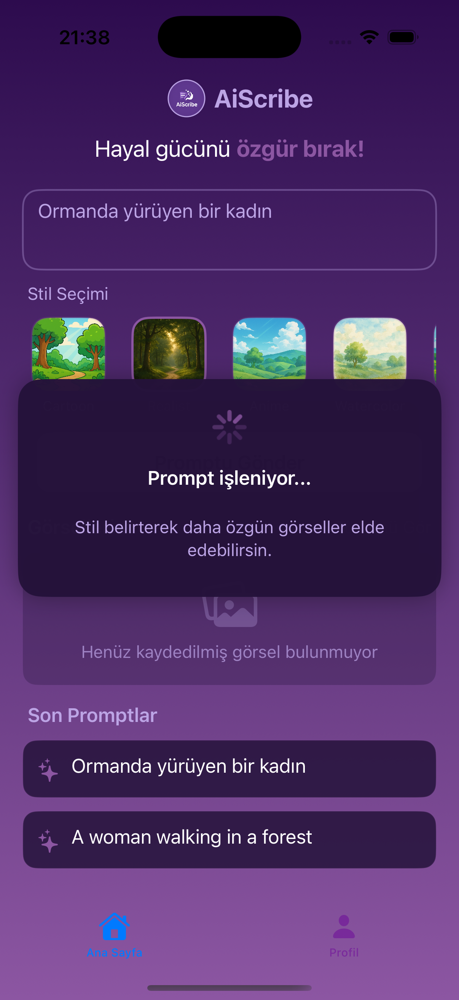
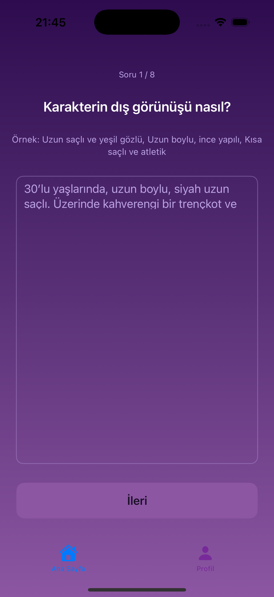
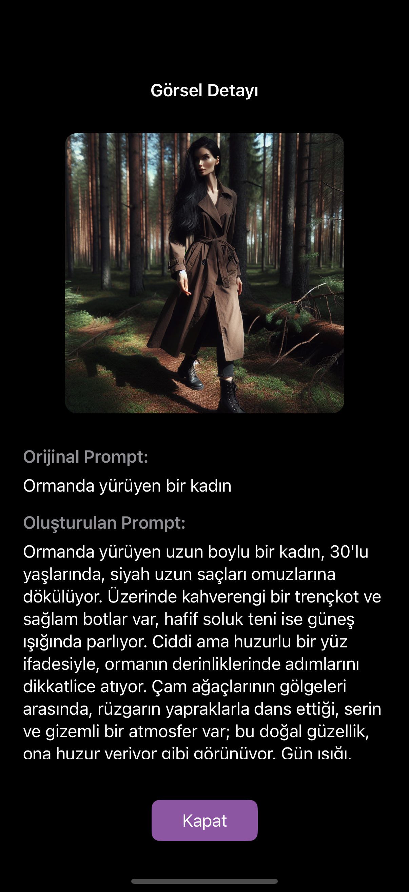

# ✍️ AiScribe – AI-Powered Visual Prompt Assistant

AiScribe helps you turn short, simple ideas into detailed visual prompts using LLM agents. It analyzes, expands, and structures your input step-by-step for stunning image generation.

---

## 🧠 How It Works

1. 💬 **You write a short idea** (e.g., “a cat riding a bicycle”)
2. 🧩 **AiScribe analyzes** your input using multiple AI agents:
   - PromptAnalyzerAgent
   - AutoPromptExpanderAgent
   - ModuleSuggesterAgent
3. ✨ It generates a structured and highly descriptive prompt ready for image generation.

---

## 📱 App Preview

| Home | Step-by-step Flow | Final Prompt |
|------|-------------------|--------------|
|  |  |  |

> Intuitive native iOS experience built with SwiftUI. AI flow is designed for non-technical users.

---

## ✨ Features

- 🔍 AI-based prompt analysis (emotions, characters, context detection)
- 🧠 Multi-agent architecture powered by **AutoGen Framework**
- 🔄 Automatic prompt expansion with structured modules
- 📤 Native integration with **DALL·E** via OpenAI API
- 📝 Editable prompt sections and resuggestions
- 📱 iOS-first interface with clean and fast SwiftUI components

---

## ⚙️ Technologies Used

- **Frontend:** Swift / SwiftUI  
- **AI Framework:** AutoGen (multi-agent orchestration)  
- **LLM Model:** OpenAI GPT  
- **Image Generation:** DALL·E  
- **Architecture:** Modular JSON flow, async API calls, section scoring

---

## 🚀 Example Prompt Flow

> **Input:** “a magical bird flying in space”  
>  
> **Output:**  
> "A vibrant fantasy bird with glowing feathers soars through deep space, surrounded by colorful nebulas and stars. The scene has a dreamy and surreal mood. High detail, cinematic lighting."

---

## 📦 Getting Started

This is a private iOS project currently in development.  
For a technical walkthrough or testflight demo, feel free to get in touch.

---

## 📧 Contact

[ferhatsli63@gmail.com](mailto:ferhatsli63@gmail.com)  
[linkedin.com/in/ferhat-taşlı-674953218](https://linkedin.com/in/ferhat-ta%C5%9Fl%C4%B1-674953218)

---