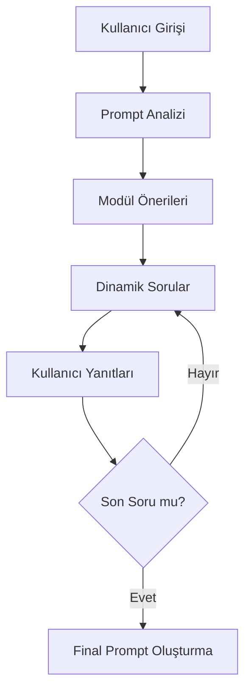

# AiScribe Proje Raporu

## Proje Genel Bakış

AiScribe, kullanıcıların metin tabanlı görsel fikirlerini detaylı ve yapılandırılmış görüntü oluşturma komutlarına dönüştüren interaktif bir web uygulamasıdır. Proje, yapay zeka destekli soru-cevap akışı ile kullanıcıların görsel fikirlerini zenginleştirmekte ve optimize etmektedir.

## Teknik Mimari

### 1. Frontend (Kullanıcı Arayüzü)
- **Streamlit Framework**: Modern ve responsive bir web arayüzü için Streamlit kullanılmıştır
- **Özel CSS Tasarımı**: Kullanıcı deneyimini iyileştirmek için özelleştirilmiş stil tanımlamaları
- **İnteraktif Bileşenler**: 
  - Dinamik soru-cevap akışı
  - İlerleme çubuğu
  - Genişletilebilir örnek yanıt bölümleri
  - Yanıt geçmişi görüntüleme

### 2. Backend Bileşenleri

#### Agent Sistemi
1. **PromptAnalysisAgent**
   - Kullanıcının başlangıç komutunu analiz eder
   - Temel görsel elementleri ve temaları belirler

2. **ModuleSuggestionAgent**
   - Analiz sonuçlarına göre iyileştirme önerileri sunar
   - Görsel detayları zenginleştirmek için modül önerileri oluşturur

3. **DynamicQuestionAgent**
   - Kullanıcı yanıtlarına göre adapte olan soru akışını yönetir
   - Maksimum 5 soru ile kullanıcının vizyonunu netleştirir
   - Final promptunu oluşturur ve optimize eder

### 3. Veri Akışı


## Temel Özellikler

1. **İnteraktif Prompt Geliştirme**
   - Kullanıcı dostu arayüz
   - Adım adım rehberlik
   - Gerçek zamanlı geri bildirim
   - Görsel örneklerle desteklenen sorular

2. **Akıllı Soru Sistemi**
   - Bağlama duyarlı soru üretimi
   - Önceki yanıtlara göre adapte olan soru akışı
   - Maksimum 5 soru ile optimal prompt oluşturma

3. **Oturum Yönetimi**
   - Streamlit session_state ile durum takibi
   - Yanıt geçmişi kaydı
   - İlerleme durumu gösterimi

4. **Kullanıcı Deneyimi İyileştirmeleri**
   - Modern ve estetik arayüz tasarımı
   - Duyarlı (responsive) tasarım
   - Görsel geri bildirimler ve animasyonlar
   - Kolay navigasyon

## Karşılaşılan Zorluklar ve Çözümler

1. **Asenkron İşlem Yönetimi**
   - **Sorun**: Yapay zeka modellerinin yanıt sürelerinin uzunluğu
   - **Çözüm**: asyncio kütüphanesi ile asenkron işlem yönetimi
   
2. **Durum Yönetimi**
   - **Sorun**: Sayfa yenilenmelerinde veri kaybı
   - **Çözüm**: Streamlit session_state ile kapsamlı durum yönetimi

3. **Kullanıcı Arayüzü Tutarlılığı**
   - **Sorun**: Farklı aşamalarda UI tutarsızlıkları
   - **Çözüm**: Özelleştirilmiş CSS ve dinamik bileşen yönetimi

## Gelecek Geliştirmeler

1. **Çoklu Dil Desteği**
   - Türkçe dil desteği eklenmesi
   - Dil tercihine göre dinamik içerik

2. **Görsel Önizleme**
   - Oluşturulan prompt'a göre gerçek zamanlı görsel önizleme
   - Görsel stil önerileri

3. **Prompt Geçmişi**
   - Kullanıcı bazlı prompt geçmişi
   - Favori promptları kaydetme özelliği

## Teknik Detaylar

### Kullanılan Teknolojiler
- Python 3.13
- Streamlit Framework
- OpenAI API
- asyncio
- python-dotenv

### Kod Organizasyonu
```
AiScribe/
├── agents/
│   ├── prompt_analysis_agent.py
│   ├── module_suggestion_agent.py
│   └── dynamic_question_agent.py
├── app.py
└── requirements.txt
```

## Mevcut Durum

Proje şu anda MVP (Minimum Viable Product) aşamasındadır ve temel işlevselliği başarıyla gerçekleştirmektedir. Kullanıcılar başlangıç promptlarını girebilmekte, sistemin yönlendirdiği sorulara yanıt verebilmekte ve optimize edilmiş final promptlarını alabilmektedir.

Arayüz tasarımı modern ve kullanıcı dostu bir yaklaşımla tamamlanmış olup, temel iş akışı sorunsuz çalışmaktadır. Yapay zeka destekli soru-cevap sistemi, kullanıcıların görsel fikirlerini detaylandırmada etkili bir şekilde çalışmaktadır.

## Sonuç

AiScribe, kullanıcıların görsel fikirlerini yapılandırılmış ve optimize edilmiş promptlara dönüştürme hedefine başarıyla ulaşmıştır. Projenin mevcut durumu, belirlenen temel gereksinimleri karşılamakta ve gelecek geliştirmeler için sağlam bir temel oluşturmaktadır. 